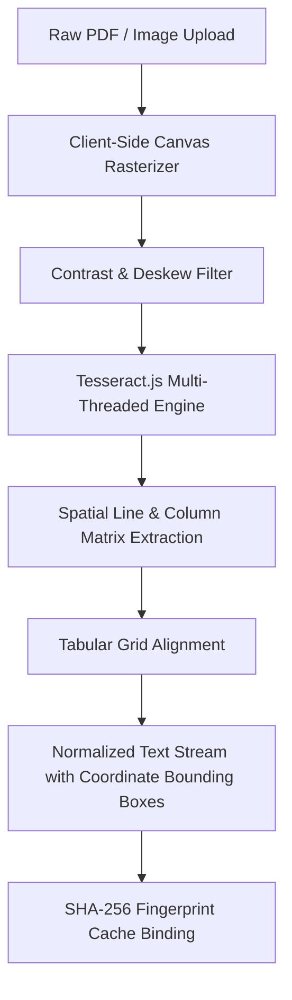

# 01 - OCR & Document Normalization Pipeline

## Engineering Principles
1. **Coordinate Bounding**: Every recognized character sequence retains its `{ page, line, boundingBox: { x, y, width, height } }` coordinate matrix.
2. **Tabular Column Detection**: Blood panels present tabular headers (Test Name, Result, Units, Reference Interval, Status). MedLens uses adaptive horizontal whitespace thresholding to avoid column merging.
3. **Fidelity Scoring**: The engine extracts raw character confidence probabilities (0-100) feeding into the downstream Consensus Engine as a 40% weighted signal.
