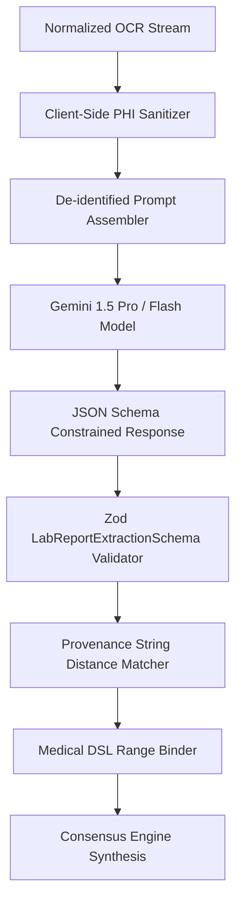

# 02 - AI Extraction Pipeline & Provenance Architecture

## Guarantees
- **Type Compliance**: Every response is verified against runtime Zod schemas (`LabReportExtractionSchema`). Any malformed response is caught and rejected before UI delivery.
- **Strict Anchor Matching**: LLM extracted items are reverse-matched against the original OCR line array to guarantee 100% provenance coverage.
- **Explainability Payload**: Each biomarker output contains an explainability object detailing why a result is categorized as normal, elevated, or deficient.
