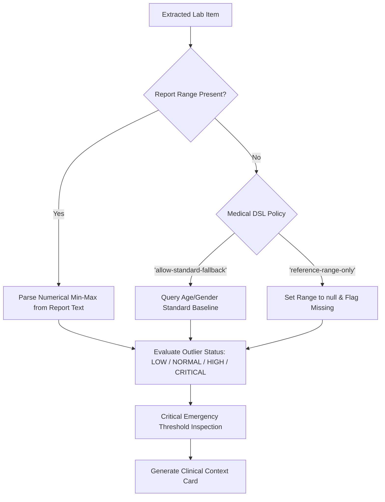

# 03 - Reference Range Engine & Medical DSL

## Anti-Hallucination Protocol
Traditional medical LLM wrappers frequently hallucinate reference ranges when absent from a lab report. MedLens enforces the `Medical DSL`:
- If an assay is flagged `reference-range-only` (such as Hemoglobin, WBC, Platelets), MedLens **forbids** AI extrapolation.
- Ranges are strictly anchored to lab text. If missing, the status is explicitly marked as `UNKNOWN / RANGE_UNSPECIFIED` rather than fabricating synthetic boundaries.
