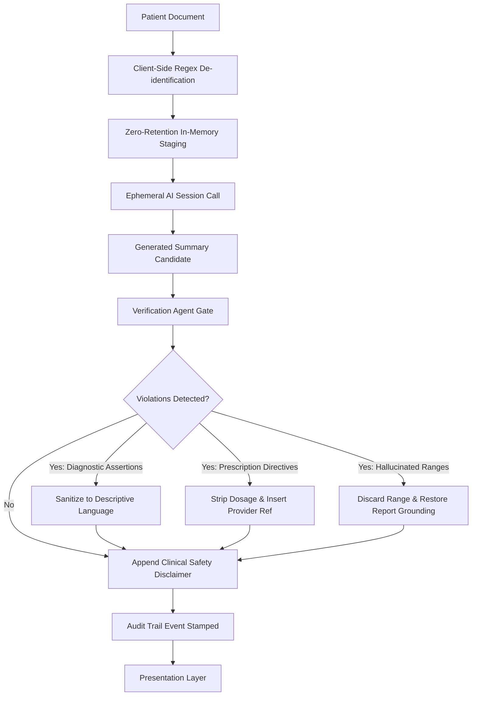

# 04 - Security, Privacy & Verification Agent Flow

## Security Guarantees
1. **Client-Side Sanitization**: Names, MRNs, SSNs, phone numbers, and addresses are stripped in browser memory before any outbound API call.
2. **Zero-Retention**: No patient data or uploaded PDFs are stored on server disks or persistent databases.
3. **Verification Agent**: Ensures generated text never oversteps clinician boundaries by offering direct diagnoses or medications.
