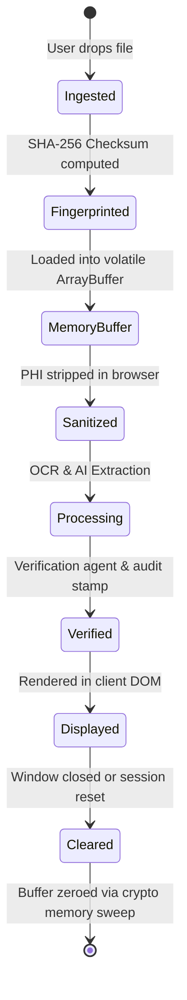

# 05 - Data Lifecycle & Zero-Retention Architecture

## Lifecycle Rules
- **Memory Lifetime**: Volatile browser RAM only.
- **Storage**: No `localStorage`, no cookies with PHI, no disk persistence.
- **Eviction**: Session reset triggers `window.crypto.getRandomValues()` over sensitive buffers before garbage collection.
- **Audit Logs**: Stored strictly as de-identified non-PHI events (`auditLogger.getLogs()`).
